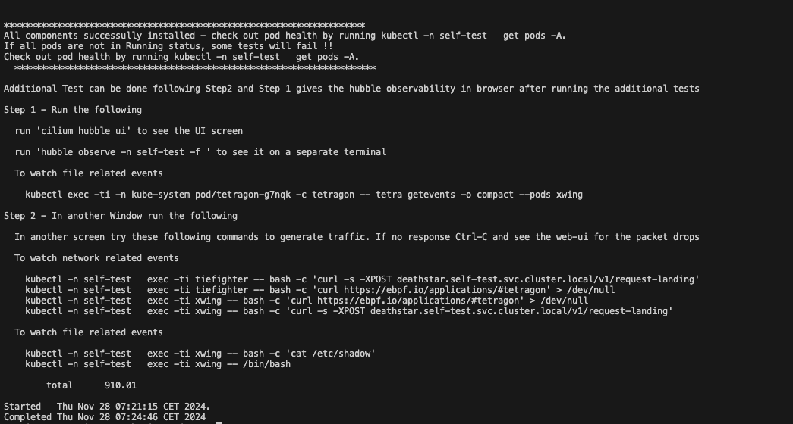
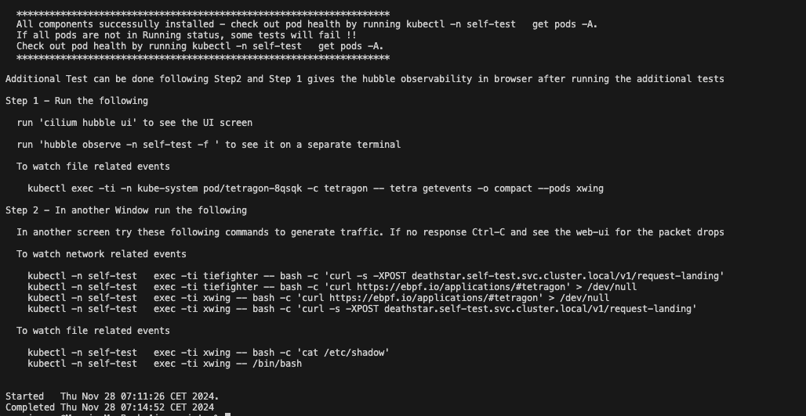
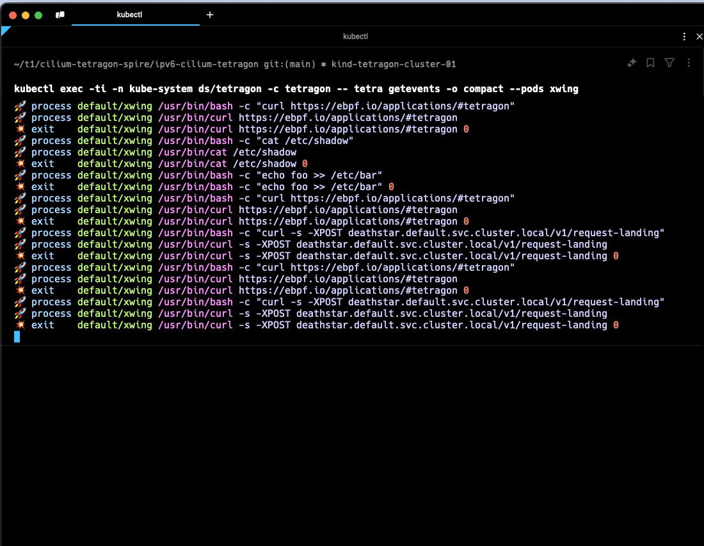
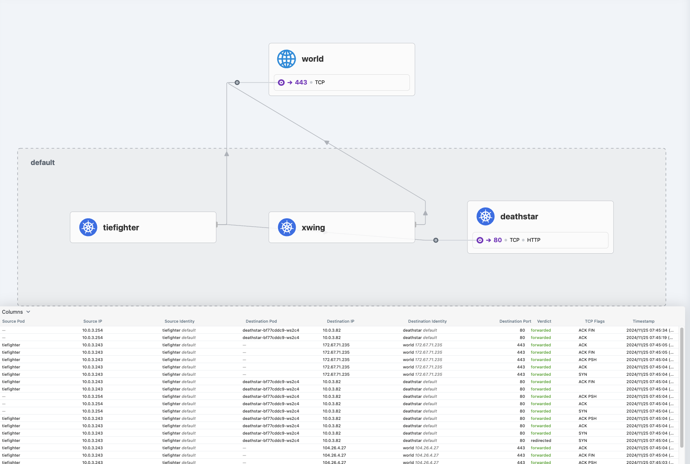
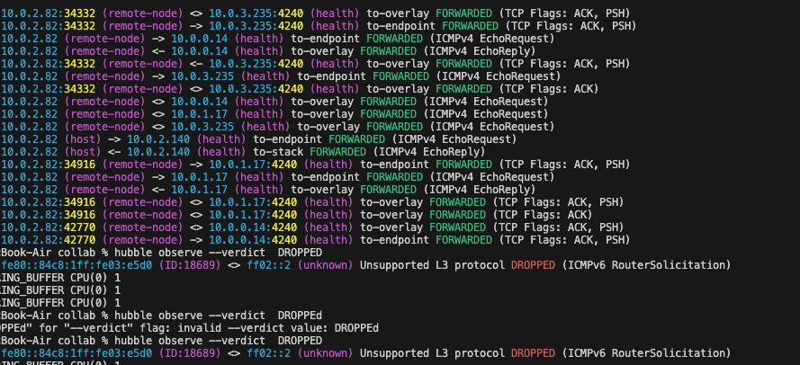
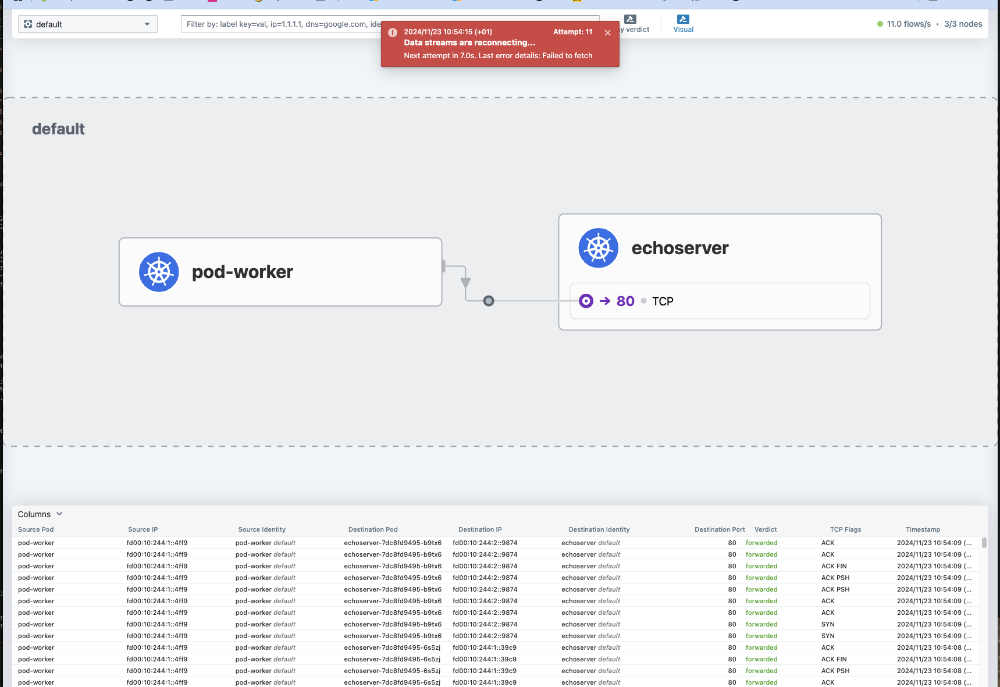

# Cilium, Spire and Tetragon Testing

This script provides an interface for managing Kubernetes clusters and running tests for [Tetragon](https://tetragon.io/), [Cilium](https://cilium.io/) with specific configurations. This environment also has [Spire](https://spiffe.io/) for [K8S](https://kubernetes.io/) and bare-metal, and will be integrated progressively.

This is a playground for learn:

- IPV6 testing within the clusters. 
- Testing out Cluster Mesh 
- Spire Integration -started (does not fully work yet)

---

## Prerequisites

Tested on MacOS Macbook Apple M3, 16 Gb RAM running Sequoia 15.1.1 (24B91)

Ensure the following tools are installed and properly configured:
- [Kind](https://kind.sigs.k8s.io/)
- [Brew](https://brew.sh/)
- [Docker](https://www.docker.com/)
- [Git](https://github.com/)
- [Cilium CLI](https://docs.cilium.io/en/stable/gettingstarted/k8s-install-default/)

> **Note:** If Cilium CLI is not installed, the script will prompt for `sudo` access to install it.

---

## Testing

First clone the repository

	git clone https://github.com/manojmenon/cilium-tetragon-spire.git

	cd cilium-tetragon-spire/cilium-spire-tetragon/scripts 

- #### Important Notes    

	- ⚠️   For Tetragon, make sure you have multiple terminals open to observe the events - instructions will appear on scren during the test run.
		- Window 1, run watch kubectl get pods --all-namespaces (In Mac, `brew install watch` to install)
		- Window 2, keep it for running the tetragon observability or hubble observe commands 
	- ⚠️  There is atleast one place a sudo for installing Cilium cli - please install it prior to testing to avoid being asked for the sudo password
	- ⚠️  This repo is entirely (almost) shell scripts and there is no strict error checking after each command consistently. Please open them, review and only after you are comfortable run them.
	- Edit test.sh for any tweaks, and then only run

- #### You must have installed kind, brew, docker, cilium cli

- ⚠️   Run at your own risk ...but then there are risks everywhere  :-). No, not really, there is one sudo command to install cilium cli. If you install it, the program will not attempt to install.

		./test.sh

- 🌟 Press Ctrl-C to exit after the program run or at any time

Once the run is complete - it can take upto 5 minutes to finish

In a separate terminal window you can watch the program building the environment by typing

	watch kubectl get pods -A

if for any reason, one or the cotainers takes too long to build, then there is some issue in the pre-requisites environment.

Kindly note at one point the program will ask you to press <CR> (towards the end)

The screen sot below sshows the full set of running pods

## Environment

Only One Cluster is created. Tetragon,  Cilium and Spire is all running at Cluster Level.

List the clusters

	kind get clusters
	
Get Contexts

	kubectl config get-contexts

Switch Contexts

    kubectl config use-context <CONTEXT-NAME> 

As an example

     kubectl config use-context kind-cilium-cluster-01 

## Usage

To list the available options run

        ./main_shell.sh

Generic command line syntax is 

	./main_shell.sh --cluster-config-file <CONFIG_FILE_PATH> <TARGET> <OPTIONS>

    <TARGET>

 		- tetragon | cilium | cluster

    <OPTIONS>

 		- install | delete | test

Please note that the ***--cluster-config-file*** is a **mandatory** yaml file for creating the KIND clusters. This way we can have more options specified in the K8S Config file.

- 🌟 The cluster name should be unique in the various clusters and is taken from the above cofig yaml file.

<!-- This is a comment 
- ✅ Task Complete
- ⚠️  The cluster name should be unique in the various clusters and is taken from the above cofig yaml file.
-->

#### Tetragon

This cluster has only one node in the control-plane. (More work to be done to do multi-node)

	cd cilium-tetragon-spire/cilium-spire-tetragon/scripts 
	./main_shell.sh --cluster-config-file ../cilium/config/cluster-config.yaml --tetragon --test

- If the cluster does not exist, it will be created.
- If cilium is not in the cluster, it will be installed (for networking)
- It also deploys the demo pods that is from Tetragon - xwing, tiefighter and deathstar

Watch for the instructions in the screen - typical installation takes around 3 minutes.

- ⚠️  Make sure you have multiple terminals open to observe the events - instructions will appear on scren during the test run.

Follow the instructions on the screen and you will see the events being reported by Tetragon in the window where the events are bging captured.

Currently you will see the following kinds of events. 

- ⚠️  Not all Tests are currently working now.

- File Processing
- Process Related
- Networking Events
- Policy Enforcement

Additional tests using the Demo app can be tested as in the [Cilium Demo](https://docs.cilium.io/en/stable/gettingstarted/demo/) site.

You can also run from another terminal window the hubble ui to observe the packet movement for each of the above events tests.

	hubble enable ui

In the window that you opened you can see the Events corresponding to the activity. The yaml files in the tetragon directory enforce the policies. 

##### Events from the Tetragon Demo once you run Step 1 and Step2 instructions which appear towards teh end.

##### Events from the Hubble Observe aafter running some of the end point access

For any further activities, one can set the environment as follows.

    kubectl config use-context kind-cilium-cluster-01

After the environment has been setup, you can use kubectl for interfacing with this instance

#### Cilium

	cd cilium-tetragon-spire/cilium-spire-tetragon/scripts 
	./main_shell.sh --cluster-config-file ../cilium/config/cluster-config.yaml --cilium --test
	
- If the cluster does not exist, it will be created.
- If cilium is not in the cluster, it will be installed (needs for networking)
- It also deploys 3 other pods pod1, pod2 and 5 replicas of the echo-server

The testing file continues in the backup and a browser for Hubble is open and you an see the traffic flow.

For any further activities, one can set the environment as follows.

    kubectl config use-context kind-cilium-cluster-01

After the environment has been setup, you can use kubectl for interfacing with this instance

#### Spire

Spire is automatically installed in the cilium-spire namespace.

Checkout the instructions - the mTLS handshake is only done once !!

### To Teardown

#### Tetragon

	cd cilium-tetragon-spire/cilium-spire-tetragon/scripts 

	./main_shell.sh --cluster-config-file ../cilium/config/cluster-config.yaml ---cluster --delete

#### Cilium

	cd cilium-tetragon-spire/ipv6-cilium-tetragon/scripts
	./main_shell.sh --cluster-config-file ../cilium/config/cluster-config.yaml --cluster --delete

#### Spire

Spire is in the K8S Cluster and gets deleted when the cluster gets deleted. It runs in the namespace cilium-spire, if you want to delete at namespace level.

#### Cluster

- ⚠️ All objects in the clusters will be lost if you run the --cluster --delete.

- Options offer you an opportunity to exit. Press any other key than y or Y.

	cd cilium-tetragon-spire/cilium-spire-tetragon/scripts 

	./main_shell.sh --cluster-config-file ../cilium/config/cluster-config.yaml ---cluster --delete

## Known Issues

- Spire server works, but the agent and the deployment needs addressing

## ToDo

- Cluster Mesh

---